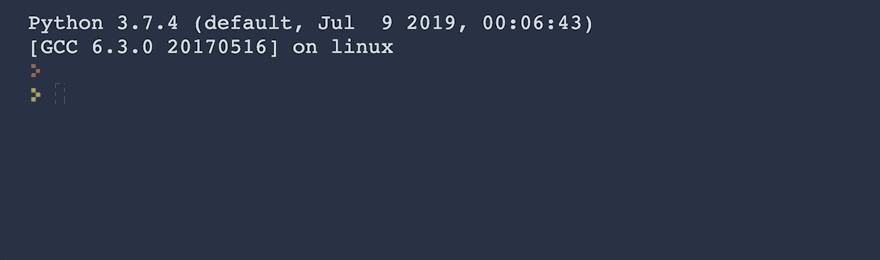

# Instructions
Write a program that calculates the Body Mass Index (BMI) from a user's weight and height.

The BMI is a measure of some's weight taking into account their height. e.g. If a tall person and a short person both weigh the same amount, the short person is usually more overweight.

The BMI is calculated by dividing a person's weight (in kg) by the square of their height (in m):


Warning you should convert the result to a whole number.

# Example Input
```
weight = 80
height = 1.75
```

# Example Output
```
80 ÷ (1.75 x 1.75) = 26.122448979591837
26
```
e.g. When you hit run, this is what should happen:



# Hint
<ol>
    <li>Check the data type of the inputs.</li>
    <li>Try to use the exponent operator in your code.</li>
    <li>Remember PEMDAS.</li>
    <li>Remember to convert your result to a whole number (int).</li>
</ol>

# Test Your Code
Check your code is doing what it is supposed to. When you're happy with your code, click submit to check your solution.

# Solution
https://repl.it/@appbrewery/day-2-2-solution