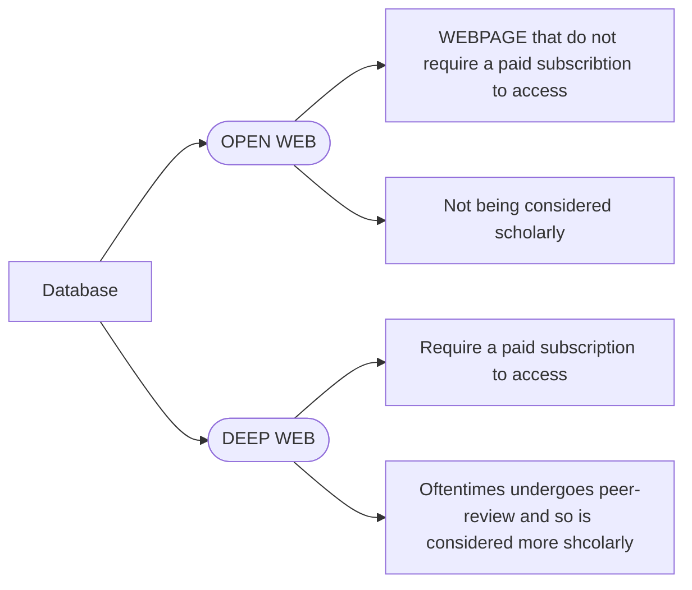

# Basic Information Literacy

## Week 1 - Course Introduction: Understanding Information Literacy:heavy_check_mark:

**Learning Objectives**:

- Define information literacy
- Compose a Mind Map to expand upon a broad topic.
- Identify three (3) ways to narrow a topic.
- Find an item in a catalog using the title.

### Course overview:white_check_mark:

### Getting Started:white_check_mark:

### Information Literacy:white_check_mark:

### Optional Reading:white_check_mark:

### Brainstorming and Mind Mapping:white_check_mark:

### End of Module(Submitted):white_check_mark:

:red_circle:Prompt: In your own words define information literacy. Include the concepts of a conversation and mind mapping in your response.(submitted):white_check_mark:

:pencil2:

**Information literacy**

In my view, information literacy means two things. The first thing is about literacy reading which means a lot of paper basic information searching and reading work need to be done, and the second thing is related to information analysis, as well as how to find and discover the most valuable information from the materials that have collected.

**Conversation**

Conversation means someone has an essential motivation and idea to talk about. Because it's incomplete, they need to develop and make an improvement of the original idea, so having a conversation could make people exchange their different idea and advice to make the former one better.

**Mind mapping**

Mind mapping is a convenient tool for people who want to make their idea clear and orderly from their twisted minds. With the help of mind mapping, people can make their concepts quite clear and present those ideas to others easily.

**At last**

Conversation and mind mapping are beneficial methods for most of us to develop our understanding of materials profoundly when we do some information literacy. So everyone could use these two tools more often to train the brain and our ability to digest the knowledge we've collected. **(submitted)**

## Week 2 - Identifying your information need

**Learning Objectives**:

- Determine sources' qualities and depth (academicness)
- Identify newspapers and magazines from search results
- Distinguish databases from other online resources (ie Google, library homepage, Wikipedia, etc)

### The Cycle of Information:white_check_mark:

 :red_circle:**Discussion Prompt: What do you understand?**:white_check_mark:

:pencil2:In the previous video, I learned something new that peer review which means a panel of experts in at a journal would examine the researcher's submitted findings and methods to ensure the credibility could up to the journal's standards.**(submitted)**

*And Below is my Reply in the Discussion Prompt*

In my opinion,  the circle of information means the message flow from the bottom to the top; the bottom means they are not tackled and post-processing; the top means they have experienced the strict examination of experts who are working in the journal which published a lot of papers and could quickly analysis the value of the information.

### Introduction to Databases:white_check_mark:

:pencil2:In China, when I want to find some Chinses papers, I usually use the database called 中国知网， 万方数据，百度学术 etc. in Chinese and here are some other databases like Science Direct, google scholar, web of science and ProQuest that  I've used ever. **(submitted)**

:pushpin:/:memo:"Open Web" versus "Deep Web" Notes:

 :red_circle:**Discussion Prompt: What are databases?**
*Find a database, provide the URL, and tell us why this is a database and not a website. Remember to reference what you've learned from the lessons.*

:pencil2:There is a database which I use a lot of times: Science Direct, link address: https://www.sciencedirect.com/. It's a database database instead of website, because it needs to be paid and its whole content like scientific papers could only be searched by library's website, and it supports keywords very well instead of natural language. **(submitted)**

### Searching Various Types of Database & Websites:white_check_mark:

:pencil:Google Scholar 

:red_circle:**Discussion Prompt: Searching a database**

*Run a search on a topic you are interested here https://search.proquest.com/*

*Tell us what terms you used and how you limited your search. What were your results?*

:pencil2:My search topic would be "hydrogen admixture combustion", the key terms that I use are *hydrogen*,  *admixture*, *combustion* these three words, the type I choose is *all*. And I just need the paper that was published within the recent five years, so I narrow down the year span. The number of search results is updated from 14,616 results to 3,416 results, which extremely decreased my searching workload. And my results are highly relevant, so I picked some of them for further study. **(submitted)**

### End of Module Quiz:white_check_mark:

:red_circle:You've searched a few online sources. Tell us what was a database? What were the characteristics? Reference this lesson's concepts. Give one example of when you would use a website vs a database.

:pencil2:Project Title: The different situation to use website vs database

The database is like a repository that stores all digital items like e-books, paper, videos, music, photo and other information that people can reach on the internet. It's diverse, but mainly providing video a visual space to show people some specific information and it's usually paid and has a piece of huge information inside. The best source for scholarly peer-reviewed articles is the Journal database, and when I need to know something more scholarly, I have to access the scholar database through the library instead of just searching some web pages. So when I'm doing research and want to increase the credibility of my experiment, I will refer to the database. **(submitted)**

## Week 3 - Searching: Finding the right tools to meet your information need

**Learning Objectives**:

- Compose appropriate search strategies in order to retrieve information
- Use keywords to run a search
- Identify key concepts from a research topic

### Creating a Search Strategy:white_check_mark:

:red_circle:Discussion Prompt: 

Create a search strategy using your own topic, or the following suggested topic:

What are the effects of remote learning on children living in rural communities?

Include the following:

1. Keywords

2. Synonyms

3. Boolean operators (AND/OR)

4. Quotation marks (where needed)

5. What database would you use this search strategy in?

6. Are there any additional facets you could add to the search in order to narrow your topic?

Share your search strategy and have others comment on it for suggestions.  

:pencil2:My topic is hydrogen blending combustion with natural gas, so the keyword is Hydrogen AND "Natural gas" and Combustion. For hydrogen/hydrogen blending, its synonym would be "h2"/"hydrogen admixture"; for "Combustion", its synonym could be "Flame" . So my final search strategy is like this: Hydrogen OR h2 OR "Hydrogen blending" OR "Hydrogen admixture" AND "Natural gas" and Combustion OR Flame. And I would like to use this in Science Direct, and I would narrow the search results by limiting the year within the last five years. **(submitted)**

### Using Boolean Operators (aka AND, OR, & NOT)

### Required Videos:white_check_mark:

:memo:Search Strategies

- **Boolean Terms/Operator**: *AND OR NOT*.

- **Quotation Marks**("keyword") could make the search result match the keyword exactly instead of just including them.

- **Truncation**(keyword) could consider the situation of teenagers and *<u>teen</u>*, because both forms could represent teenagers.

:memo:Skimming an Article

Scholarly articles, included

- Title:one:
- Abstract:two:
- Background Information
- Method / Results
- Discussion / Conclusion:three:
- References:four:: Lead to other valuable papers

### End of Module Quiz:white_check_mark:

:red_circle:Run a basic search in WorldCat [https://www.worldcat.org](https://www.worldcat.org/). Now run an advanced search https://www.worldcat.org/advancedsearch using Boolean operators, quotation marks and/or truncation (*) discuss the differences in results. Why did you get different results? Refer to this modules' lessons for specific reasons.

:pencil2:Project Title: The difference between basic search and advanced search - from my own practice.

Firstly, I run a basic search using the phrase *hydrogen admixture combustion* which gets me about 144 results. And they're not all related closely to what I really want. 

When I switch to advanced search using the phrase *"hydrogen admixture" AND combustion* results in only 25 results. The quotation with *hydrogen admixture* extremely makes the results exactly match  the phrase what I typed; the keyword *combustion* means anything including the word *combustion*, the boolean operator AND between *"hydrogen admixture"* and *combustion* tremendously narrowed the search results from 144 to 25, and the results I'm done become more precise, neat and relevant. **(submitted)**
