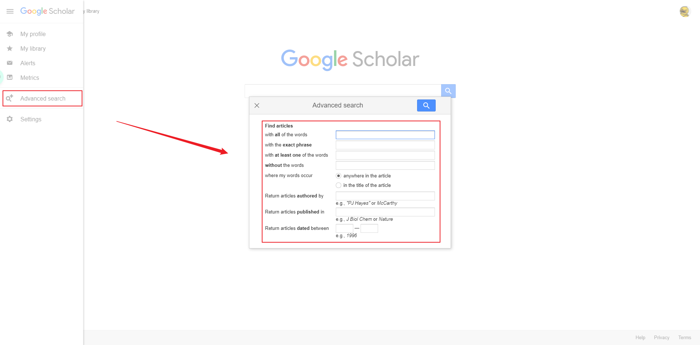

# Basic Information Literacy

## Week 1 - Course Introduction: Understanding Information Literacy:heavy_check_mark:

**Learning Objectives**:

- Define information literacy
- Compose a Mind Map to expand upon a broad topic.
- Identify three (3) ways to narrow a topic.
- Find an item in a catalog using the title.

### Course overview:white_check_mark:

### Getting Started:white_check_mark:

### Information Literacy:white_check_mark:

### Optional Reading:white_check_mark:

### Brainstorming and Mind Mapping:white_check_mark:

### End of Module(Submitted):white_check_mark:

:red_circle:Prompt: In your own words define information literacy. Include the concepts of a conversation and mind mapping in your response.(submitted):white_check_mark:

:pencil2:

**Information literacy**

In my view, information literacy means two things. The first thing is about literacy reading which means a lot of paper basic information searching and reading work need to be done, and the second thing is related to information analysis, as well as how to find and discover the most valuable information from the materials that have collected.

**Conversation**

Conversation means someone has an essential motivation and idea to talk about. Because it's incomplete, they need to develop and make an improvement of the original idea, so having a conversation could make people exchange their different idea and advice to make the former one better.

**Mind mapping**

Mind mapping is a convenient tool for people who want to make their idea clear and orderly from their twisted minds. With the help of mind mapping, people can make their concepts quite clear and present those ideas to others easily.

**At last**

Conversation and mind mapping are beneficial methods for most of us to develop our understanding of materials profoundly when we do some information literacy. So everyone could use these two tools more often to train the brain and our ability to digest the knowledge we've collected. **(submitted)**

## Week 2 - Identifying your information need

**Learning Objectives**: 

- Determine sources' qualities and depth (academicness)
- Identify newspapers and magazines from search results
- Distinguish databases from other online resources (ie Google, library homepage, Wikipedia, etc)

### The Cycle of Information:white_check_mark:

 :red_circle:**Discussion Prompt: What do you understand?**:white_check_mark:

:pencil2:In the previous video, I learned something new that peer review which means a panel of experts in at a journal would examine the researcher's submitted findings and methods to ensure the credibility could up to the journal's standards.**(submitted)**

*And Below is my Reply in the Discussion Prompt*

In my opinion,  the circle of information means the message flow from the bottom to the top; the bottom means they are not tackled and post-processing; the top means they have experienced the strict examination of experts who are working in the journal which published a lot of papers and could quickly analysis the value of the information.

### Introduction to Databases:white_check_mark:

:pencil2:In China, when I want to find some Chinses papers, I usually use the database called 中国知网， 万方数据，百度学术 etc. in Chinese and here are some other databases like Science Direct, google scholar, web of science and ProQuest that  I've used ever. **(submitted)**

:pushpin:/:memo:"Open Web" versus "Deep Web" Notes:

 :red_circle:**Discussion Prompt: What are databases?**
*Find a database, provide the URL, and tell us why this is a database and not a website. Remember to reference what you've learned from the lessons.*

:pencil2:There is a database which I use a lot of times: Science Direct, link address: https://www.sciencedirect.com/. It's a database database instead of website, because it needs to be paid and its whole content like scientific papers could only be searched by library's website, and it supports keywords very well instead of natural language.**(submitted)**

### Searching Various Types of Database & Websites

:pencil:Google Scholar 

:red_circle:**Discussion Prompt: Searching a database**

*Run a search on a topic you are interested here https://search.proquest.com/*

*Tell us what terms you used and how you limited your search. What were your results?*

:pencil2:My search topic would be "hydrogen admixture combustion",

