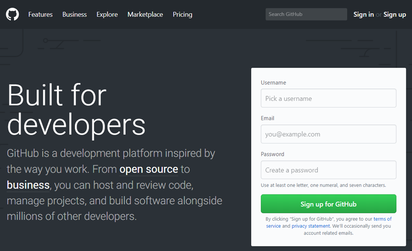
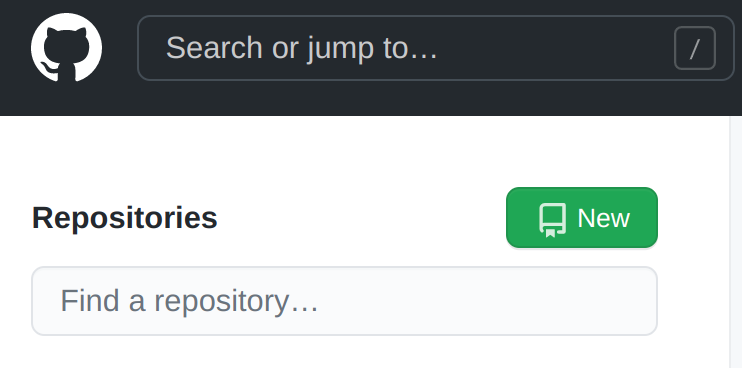
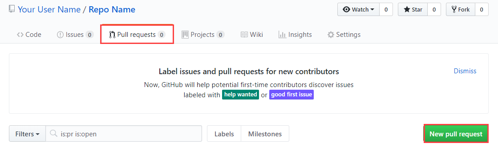

# Introduction to git and Github

## What is git?

Git is a free and open source distributed version control system designed to handle everything from small to very large projects with speed and efficiency.

Git is easy to learn and has a tiny footprint with lightning fast performance. Learn more about git [here](https://git-scm.com/).

## Lab Objectives

For this lab, you will assume a documentation persona. You are responsible for product guides at your organization. There's a release next month, so you need to update a product guide in preparation for the release.

The skills you'll practice are applicable to any role involved with storing work in git (code, documentation, any type of file).

At the end of this lab, you will be able to:

- Create a repo
- Make changes to the code base
- Open up a pull request (PR)
- Merge code into the master branch

## Prerequisites

You will need a GitHub account (it is free). Go to https://github.com/join and set up a GitHub account if you do not have one already.



## Install git

Start by installing git on your instance. When you're working on your own projects, it is always a good idea to check for updates even if you already have git installed. You can install it as a package, via another installer, or download the source code and compile it yourself. In this lab, you will install it via a binary installer using `yum`.

1. Click the **SSH** button for your VM instance that was made for you when you started the lab and then click **Connect**.
2. Download package information from all configured sources.

```git
sudo apt-get update
```

**Note:** You can click the clipboard icon to copy it to your clipboard, then paste it into your session. You can do this throughout the lab.

3. Run the following command:

```git
sudo apt-get install git-all
```

4. You may be prompted to type **Y** to confirm installation.
5. Verify your installation with the following command:

```git
git --version
```

The response will be the git version. If your response is something like *-bash: git: command not found*, there was a problem with the installation and you should try again.

Click **Check my progress** to verify your performed task. If you have completed the task successfully you will be granted with an assessment score.

## Create a local git repository

Now that git is installed, create a new repository (or repo for short) to hold your release notes. When you work on your own projects, you can create repositories in any directory you want.

1. Create a directory for your project with the `mkdir` (make directory) command:

```git
mkdir myproject
```

2. Then open the directory with the cd (change directory) command.

```git
cd myproject
```

3. Now, initialize your new git repository in the folder with the `git init` command:

```git
git init
```

Congratulations! You just initialized a git repository.

## Add a file to the repo

Your repository is empty. It's time to put something in it!

1. Add a new file to the project. You can use any text editor you like when you are working on your own projects, but for this lab, simply create a new file with the `touch` command. Replace `<file name>` with a name for your file:

```git
touch <file name>.txt
```

2. Run the `ls` (list) command to verify that the file was created in your project directory:

```git
ls
```

3. Check to see which files git knows about with the `git status` command:

```git
git status
```

What do you see? Git's saying that it knows the file exists, but since you haven't added the file to the repo yet, git isn't saving it.

## Add a file to staging

The next step is to add your file to the staging environment (sometimes referred to as the index). You must do this before you commit a file. When you're working, use the staging environment as just that - a staging ground - for actively editing your files.

1. Add the file to the staging environment with the `git add` command:

```git
git add <file name>.txt
```

2. Run the git status command again:

```git
git status
```

Notice the "Changes to be committed" line. You will see that git added your file to the staging environment, but the file has not yet been added to a commit.

## Create a commit

A [commit](https://git-scm.com/docs/git-commit) is a record of what files you have changed since the last commit. Commits allow you to go back to the state of the project at any point in history. You create a commit in order to add files to the Master.

First you need to identify yourself, then you can create the commit.

1. Run the following, filling in any email for "you@example.com":

```
git config --global user.email "you@example.com"
```

2. Run the following, filling in any name for "Your Name":

```
git config --global user.name "Your Name"
```

3. Run the following git commit command. Your message should relate to what's in your commit - for posterity:

```
git commit -m "<your message about the commit>"
```

## Create a new branch

Now that you have mastered the basics, time for something a little more advanced.

Back to your documentation use case, say there is a release coming out next month, and the release includes significant changes to one of your products. You need to update the product guide to help your customers use the new features. You want to make changes to the product guide but you are worried about editing a guide that is actively used for reference by your team and shared with your customers. The solution? [Git branches](https://git-scm.com/book/en/v1/Git-Branching-What-a-Branch-Is).

Branches let you move back and forth between versions, or states, of any given project. In this example, you can create a new branch for the upcoming release without affecting the current product guide. Once you're done with the product guide updates, you can merge your changes from the release branch to the master branch.

**Bonus:** Git tracks the history of branches for you so you always know the history behind all your files and versions.

1. Since you're on the master branch already, run the `git checkout -b` command and name your branch. The command will:

- Automatically create a new branch, using the name you specify
- Immediately check the branch out to you
- Move you to the new branch

```git
git checkout -b <branch name>
```

1. Confirm that your branch was created:

   ```git
   git status
   ```

2. Switch back to the master branch.

   ```git
   git checkout master
   ```

3. Make another file and add it:

   ```git
   touch <file name>.txt
   ```

   ```git
   git add <file name>.txt
   ```

4. Use `git commit -m "Your message about the commit"` to stage your changes.

5. Return to your branch.

   ```git
   git checkout <branch name>
   ```

Do you see any of the latest commits? You won't see the changes until you merge them into your new branch.

## Create a GitHub repo

If you're the sole owner of your project, you don't need to use GitHub. But if you're on a team, you can use GitHub to collaborate without stepping on each others' toes.

1. To create a new repo on GitHub, go to [github.com](https://github.com/) and log in.
2. Click **New**:



3. GitHub will ask you for some basic info about your repo. Fill out the form, then click **Create repository**.
4. GitHub will ask you if you want to start from scratch or add a local project. Since you just created a new repo, you want to push that to GitHub. Follow the **"...or push an existing repository from the command line"** section and then copy the `GitHub repo URL`.
5. Return to your SSH window and run the commands.

```git
git remote add origin <your GitHub repo URL>
git push -u origin master
```

**Note**: You will be prompted to log in. Use your GitHub credentials. When prompted for password, use a `personal access token`.

- The first command adds the local repository to your GitHub repository.
- The second command pushes your local repo to GitHub.

## Push a branch to GitHub

Pushing the commit in your branch to your new GitHub repo allows other people to see the changes you've made (think code review). The repository's owner can review changes prior to merging to the master branch.

1. Run the following command to push changes onto a new branch on GitHub, replacing `branch name` with a name of your branch. Does GitHub automatically create the branch for you on the remote repository?

   ```git
   git push origin <your branch name>
   ```

2. In GitHub, click on the **Code** tab. You should now see the branch name you just pushed.

3. Click the **Compare & pull request** button that is next to your branch name.

4. You'll now see the name of your commit. In a production environment you could leave a comment about this commit. For this lab click **Create pull request**.

5. GitHub verifies that the files you are adding aren't in conflict with the Master copy. If everything checks out, and it should since these are new files, you will see a green check mark. Click **Merge pull request**, then **Confirm merge**.

6. You'll see a "Pull request successfully merged and closed" message. At this point you can click the **Delete branch** to clean up. You don't have to do this, but you may end up with a mess if you have too many branches. Notice that you'll have another chance to leave comments.

## Update a file

You have added new files to your repo. Now go back to your SSH window to edit one of those files, then commit that file to GitHub. This will show you how GitHub manages changes.

1. Back in your SSH window, switch to the Master branch and review the files it has:

   ```git
   git checkout master
   ```

   ```git
   ls
   ```

2. Now create and name a new branch for the work you're about to do:

   ```git
   git checkout -b <new branch name>
   ```

3. Edit it one of your files:

   ```git
   pico <file name>.txt
   ```

4. Type some content into the .txt file, then save it.

5. Add the file to the staging environment:

   ```git
   git add <file name>.txt
   ```

6. Now commit this change to GitHub:

   ```git
   git commit -m <new comment>
   ```

7. Push this branch:

   ```git
   git push origin <new branch name>
   ```

## Create a Pull Request

Now that you have added your updates, you need to notify a repo's owner that you want to make changes to their files through a *pull request*. A pull request (PR) allows them to review your changes to make sure it looks good before putting your changes on the master branch (which are documentation updates in this use case, but could also be code changes or any number of other cases).

Since you are the sole owner of your repo for this lab, you don't have to create a PR to merge your changes, but it's a good idea to create one anyway to track the history of your updates.

### Create your PR in GitHub

1. Return to your GitHub window.
2. Open a pull request by clicking the **Pull requests** tab, then **New pull request**.



3. In the **Compare and review** section, click on your branch name.
4. You'll be shown what changed in the file that you're adding to Master. Click **Create pull request**
5. You'll see the name of the second commit you created. Now click **Create pull request**.
6. GitHub verifies that your changes are good. Click the **Merge pull request** to add your changes into the master branch. Click **Confirm merge**.

***Is the button gray?** Probably not right now. When this button is gray, you have a merge conflict. A change in one file conflicts with a change in another, and git can't decide which one is correct. If you have a merge conflict, you have to tell git which version to use.*

## Clean up and verification

1. Clean up after yourself by deleting your branch, click the **Delete branch** button.
2. Double check that your commits were merged by clicking the **Commits** link on the first page of your new repo.
3. Find your commit.
4. Notice the hash code of the commit.

***It's worth mentioning** The hash code is unique for the specific commit. It's useful for identifying specific commits when you're reviewing (and maybe undoing) changes with the git revert command: `git revert <hash code number>` You don't need to run this command now.*

## Sync your local project with GitHub

Right now, the commit that you made in your branch then merged into the master branch doesn't exist in the version of Master on your local machine. Time to update your local version of Master.

1. Use the `git pull origin master` command (specific to the master branch) to get the most recent changes from GitHub to your local repo.

   ```git
   git pull origin master
   ```

2. Use the git log command to see all new commits.

   ```
   git log
   ```

3. Switch back to the master branch in your remote session. Use thee `git checkout master` command:

   ```git
   git checkout master
   ```

4. If you see the warning "Your branch is behind....", this means your local branch needs to add the commits from GitHub Master. Run the following:

   ```git
   git pull origin master
   ```

5. Then run the following to confirm everything is synced:

   ```git
   git checkout master
   ```

6. You should see a message that confirms your local repository is now up to date.

## Congratulations!

You successfully completed the basic git workflow. You now know how to:

- Make changes to the code base
- Open up a pull request (PR)
- Merge code into the master branch

...and you created a GitHub account so you can get started on future projects.

### Additional Resources

- [Installing Git](https://git-scm.com/book/en/v2/Getting-Started-Installing-Git)
