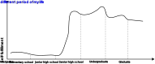
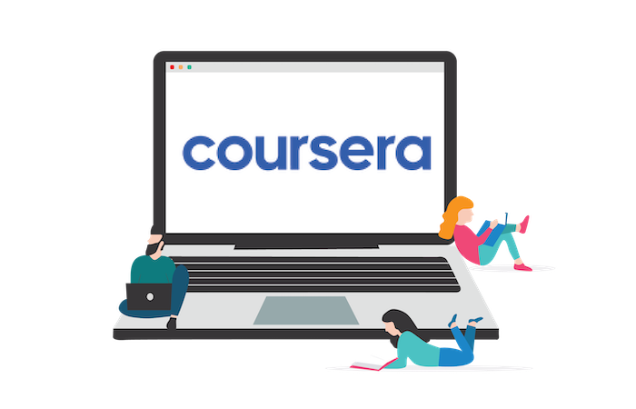

# Online learning Repository

## Introduction

Regarding someone may inquiry: **why do you do this ?**

Here is the answer hiding in the graph, and *just for fun*:

## Coursera

---

**Emoji** that I get used to noting:

- :heavy_check_mark: represents the section (week X) is done (or finished) by myself. 
- :white_check_mark: represents this small part is done (or finished) by myself.
- :red_circle: represents the assignment that I  need to work out.
- :pencil2: represents the original answers that I've written.
- :pushpin:/:memo: represents some Notes I take from the course.
- :one:—:five: represents sequence or importance, both is ok.
- **(submitted)** represents I  SUBMIT the answers, and it's the final version I've revised in my relative limited time.

---

:bird:**Bird View** of the Courses I've taken Or been taking:

- :closed_book: [Introduction to git and Github](/coursera/Git):heavy_check_mark:
- :closed_book: [Basic Information Literacy](/coursera/Basic_information_literacy):heavy_check_mark:
- :book:[Understanding Research Methods](/coursera/Understanding_Research_Methods):triangular_flag_on_post::memo:
- :book:[Introduction to Research for Essay Writing](/coursera/Introduction_to_Research_for_Essay_Writing)

## Udemy

- :closed_book:[Inkscape for Scientists and Engineers](/udemy/Inkscape_for_Scientists_and_Engineers):heavy_check_mark:
- :book:[How to Write a Successful Research Paper](/udemy//How_to_Write_a_Successful_Research_Paper):memo:
- :book:[100 Days of Code](/udemy//100days_python):memo:
- :book:[English Grammar Launch: Upgrade your speaking and listening](/udemy/English_Grammar_Launch):memo:

<!--

## 中国大学慕课
-->

## XUETANG ZAIXIAN

- :book:[肖星的财务思维课](/xuetangzx/caiwusiwei):memo:

## Icourse

- :closed_book:[ 从爱因斯坦到霍金的宇宙](/icourse/aiyinsitan):heavy_check_mark:
- :closed_book:[小词中的修养境界](/icourse/xiaoci):heavy_check_mark:
- :closed_book:[21世纪的工程人才：知识、能力和素质](/icourse/21century):heavy_check_mark:
- :book:[科技信息图示设计](/icourse/kejitu):memo:

## Ted

- :closed_book:[Why I keep speaking up, even when people mock my accent](/ted):heavy_check_mark:
- :closed_book:[Why I live in mortal dread of public speaking](/ted):heavy_check_mark:

## Free Speeches

### Research

- [You and Your Research](https://www.youtube.com/watch?v=e3msMuwqp-o&t=257s) by Hamming, 1995:heavy_check_mark:
- [Scientific Writing: Beyond Tips and Tricks](https://www.youtube.com/watch?v=jLPCdDp_LE0) by Judy Swan, 2013
- [PhD: How to write a great research paper](https://www.youtube.com/watch?v=1AYxMbYZQ1Y) from Microsoft Research, 2016
- [Get Lit: The Literature Review](https://www.youtube.com/watch?v=9la5ytz9MmM) by Dr. Hastings, 2016
- [How to Read a Paper Efficiently]() by Prof. Pete Carr, 2016
- [The basic principles every PhD student needs to know](https://www.youtube.com/watch?v=VrMwAOtB9S4) by James Hayton PhD, 2021
- [Reading research papers effectively](https://www.youtube.com/watch?v=fSCTP_obM2A) by Shady Attia, by 2021

### Education

- [Study Less Study Smart](https://www.youtube.com/watch?v=IlU-zDU6aQ0) by Marty Lobdell, 2011

- [什么是教育](https://www.youtube.com/watch?v=re8aeIP_2vg&t=2314s) by 崔永元, 2015:heavy_check_mark:
- [The Last Lecture: Achieving Your Childhood Dreams](https://www.youtube.com/watch?v=ji5_MqicxSo) by Randy Pausch, 2007:heavy_check_mark:
- [Outliers: Why Some People Succeed and Some Don't](https://www.youtube.com/watch?v=EcMKLwVlpJk) from Microsoft Research, 2016

### Communication

- [How to improve your listening skills](https://www.youtube.com/watch?v=Y9LBUf1NzU0) from Long Beach City College, 2011
  - here is a [list](https://www.youtube.com/playlist?list=PLGpClaI8mTmopP6d4-EYBuWDnwg_IHZUC) of the whole related content on YouTube.
- [The Craft of Writing Effectively](https://www.youtube.com/watch?v=vtIzMaLkCaM&t=597s) by Larry McEnerney, 2014
- [How Do I Communicate With Greater Clarity, Confidence, and Credibility?](https://www.youtube.com/watch?v=MiRmyn-hDfU) by Jayne Latz, 2015

- [Time Management](https://www.youtube.com/watch?v=oTugjssqOT0) by Randy Pausch, 2018:heavy_check_mark:
- [How to speak](https://www.youtube.com/watch?v=Unzc731iCUY&list=PLxkPF249i-__Y1sPwAvZ94ro6sMdKvju0&index=2) by Patrick Winston, 2018:heavy_check_mark:

## End

*Please enjoy yourself.*
