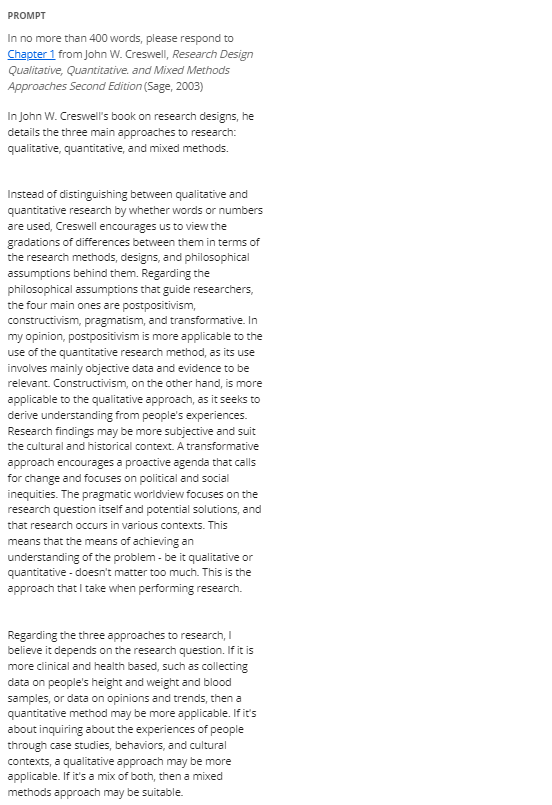
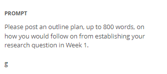
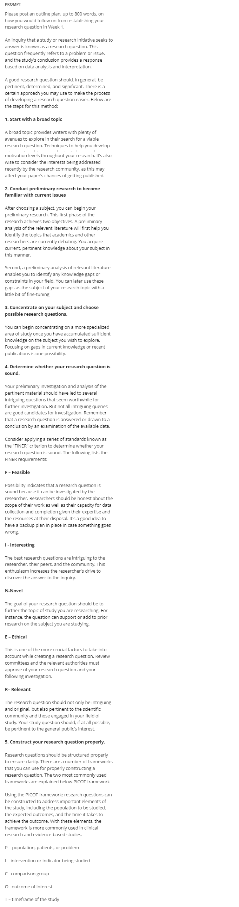
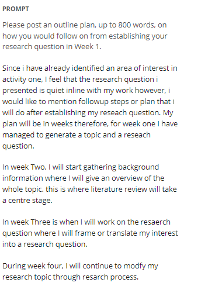

# Understanding Research Methods

**Emoji** that I get used to noting:

- :heavy_check_mark: represents the section (or week X) is done (or finished) by myself. 
- :white_check_mark: represents this small part is done (or finished) by myself.
- :red_circle: represents the assignment that I  need to work out.
- :pencil2: represents the original answers that I've written.
- :pushpin:/:memo: represents some Notes I take from the course.
- :one:—:five: represents sequence or importance, both is ok.
- **(submitted)** represents I  SUBMIT the answers, and it's the final version I've revised in my relative limited time.

## Week 1 - E-tivity 1: What Is Research and What Makes a Good Research Question?:heavy_check_mark: 

**Purpose:** To focus upon formulating a research question.

**Task:** Please compose a brief question pertaining to your proposed research - whatever the subject - and post it under the 'My Project' tab in the peer review exercise below. Be brief insofar as it would fit on one metaphorical or literal 'Post-It' note. Also watch our videos below.

**Response:** Having reflected on the videos, review other students' work. Feeding back is an important part of the research process, so please spend some time providing considered feedback for three or more colleagues here.

**Outcome:** You will have given considered thought to composing a research question and provided feedback to others on theirs.

### Introduction:white_check_mark: 

:memo:**What is an 'e-tivity'?**

E-tivity is a term coined by Professor Gilly Salmon (2002) to describe a framework for facilitating active learning in an online environment. Each e-tivity follows a format that clearly states to the students its **Purpose**, the **Task** at hand, the contribution or **Response** type, and the **Outcome**. 

### What Is Research and What Makes a Good  Research Question?:white_check_mark: 

:memo:Research:

- it must have a finite end at some point
- using information that is collected in a way that is as systematic as you can possibly be about the world to answer question; say something a little bit beyond the data itself

:memo:Research question:

- it has to have significance
  - something of significance, some issue, problem, puzzle question etc.
- it has to be well researchable
  - something that you can answer by doing research.
- it has to address a question that hasn't been definitively answered
  - there are plenty of questions that we might think are definitively answered because there's a consensus about the answer to the extent that it seems to be commonly understood what the answer of a particular question is.

### E-tivity 1:white_check_mark: 

:red_circle:**Purpose:** 

To focus upon formulating a research question.

**Task:**  

Please compose a brief question pertaining to your proposed research - whatever the subject. Brief insofar as it would fit on one metaphorical or literal "Post-It" note.

**Rubric**

You will be evaluated on whether the submission was genuine. Your peers will also provide 50 words worth of feedback on the submission.

Project title: My research questions

:pencil2:Hydrogen as a carbon-free fuel is expected to be fundamental clean energy in the future. At present, many researchers are studying how to blend hydrogen into natural gas to combust more effectively and safely because the combustion of hydrogen-enriched natural gas has some issues, like flame instability, and how to prevent its explosion, how to impact the current domestic/ commercial/ industrial appliances, and how to optimize these devices in order to accommodate the hydrogen admixture with natural gas. 

**(submitted)**

1. **Peer-graded Assignment**

:pencil2:Feedback

Sorry for that I don't have background knowledge of your topic, however, I think your question is very concrete. But as a reader I actually don't know what the question means, why it should be a significant question? What's your proof to persuade me of what you've proposed? So you can give more reasonable explanations for a better understanding. 

**(submitted)**

2. **Peer-graded Assignment**

:pencil2:Feedback

Can you write more sentences to specify what you've already known and not yet? Your answer is too short and there is no more information than I could know that "I don't know myself". So the basic advice is to write more sentences to narrow down what exactly you're questioning instead of a superficial answer. 

**(submitted)**

3. **Peer-graded Assignment**

:pencil2:Feedback

I don't understand your language at all, so please write in English to make other people to understand what you've written more easily. And a research question should be based on a research background which means the information you collected before should mostly come from the peer-viewd scholarly journals instead of one webpage or some other sources like social media platform. 

**(submitted)**

4. **Peer-graded Assignment**

:pencil2:Feedback

Your question is kind of like belonging to the research field about social science, so you can add a background to tell readers why is this question importance? And what's the main issue inside the question should be solved?  I think maybe you could make it more narrow and looks like more specific. **(submitted)**

## Week 2 - E-tivity 2: What Is a Literature Review and Why Do We Need to Do One?:heavy_check_mark: 

**Purpose:** To familiarise yourself with the nature and benefits of conducting a literature review.

**Task:** Please read the following three pieces on literature review, in conjunction with the interviews below. Then post your thoughts on one of the readings to the 'My Project' tab of the peer review (200 words).

**Response:** Provide feedback on three or more submissions by your fellow students.

**Outcome:** Upon the completion of the full cycle of this e-tivity, you will be able to distinguish the qualities of a literature review and begin to reflect on the value of a literature review to your own project.

### What is a Literature Review and Why Do We Need to Do One?  :white_check_mark: 

As you may have noticed, there are numerous books and articles out there with 'Research' and 'Research Methods' in their titles. They come in all formats and styles. Some are free and some are not. Don't be afraid to pick ones that work for you!

In certain E-tivities, however, you will also be referred to a particular section of a book. These readings have been provided to you in pdf form and can be found below.

:red_circle:**E-tivity 2**

- Chapter 1 ['The literature review: its role within research'](http://www.sagepub.com/upm-data/43465_Booth_et_al.pdf) from Andrew Booth, Diana Papaioannou, and Anthea Sutton, *Systematic Approaches to a Successful Literature Review* (SAGE, 2012), pp.1-16.
- Chapter 1 ['The literature review in research'](http://www.sagepub.com/upm-data/28728_LitReview___hart_chapter_1.pdf) from Chris Hart, *Doing a Literature Review* (SAGE, 1998), pp.1-25.
- Chapter 1 ['What is a literature review?'](http://www.sagepub.com/upm-data/58106_Kiteley_&_Stogdon.pdf) from Robin Kiteley and Chris Stogdon, *Literature Reviews in Social Work* (SAGE, 2014), pp.5-22. 

### E-tivity2:white_check_mark: 

:red_circle:**Purpose and Task**

**Task:** 

Having watched the video's ,  please identify what you consider to be *the* most important elements of a literature review in no more than 200 words. Submit your composition through this peer assessment tool.   

**Rubric:**

You will be evaluated on whether the submission was genuine. Your peers will also provide 50 words worth of feedback on the submission.

Project title: My understanding of the main points of the interviewers

:pencil2:I think the key point is inside how to find a research question instead of just diving into the numerous literature readings, so it's more important about how to engage the current research using the way more meaningfully, build a conversation could critically and robustly convey main ideas where is the gap that upcoming researchers could make efforts to fill. With literature review, again, I think the valuable and researchable questions and how to ask to find or ask such questions and argue with them are the most important elements about it.

 **(submitted)**

1. Peer-graded Assignment: E-tivity 2

:pencil2:Feedback

You don't need to repeat the words about the requirements of answer writing. Except this, it's a very comprehensive answer, and you even made several separated points to make your thoughts look like more clear for us readers. So Continue ... :-)

**(submitted)**

2. Peer-graded Assignment: E-tivity 2

:pencil2:Feedback

Please take the assignments seriously and do not copy and paste the paragraph of 0 correlation toward the reasonable answer.

**(submitted)**

3. Peer-graded Assignment: E-tivity 2

:pencil2:Feedback

Please take the assignments seriously and do not copy and paste the paragraph of 0 correlation toward the reasonable answer.

**(submitted)**

4. Peer-graded Assignment: E-tivity 2

:pencil2:Feedback

Maybe you could give out your own understanding based on the cited materials, make a concise summary of the key elements of the literature review could be more helpful when you introduce what you've learned to someone who doesn't know. 

**(submitted)**

## Week 3 - E-tivity 3: Why Are Planning and Management Skills Important for Research?:heavy_check_mark: 

**Purpose:** To be aware of the planning and management skills that are required in undertaking critical thinking for your research.

**Task:** Please watch the videos below, and also read the chapter provided. Reflect on this reading material and the videos. <u>In conjunction with your reflections on research planning and management, please post your thoughts on the chapter</u>, in no more than 400 words, under the 'My Project' tab.

**Response:** Provide feedback on three or more submissions by your fellow students.

**Outcome:** Upon the completion of the full cycle of this e-tivity, you will have reflected on the skills required to enhance your research.

### Why Are Planning and Management Skills Important for Research?:white_check_mark: 

#### E-tivity 3 - Reading:white_check_mark: 

**Reading for E-tivity 3**

There is no specific single textbook to accompany this course. As you may have noticed, there are numerous books and articles out there with 'Research' and 'Research Methods' in their titles. They come in all formats and styles. Some are free and some are not. Don't be afraid to pick ones that work for you!

In certain E-tivities, however, you will also be referred to a particular section of a book. These readings have been provided to you in pdf form and can be found below.

:red_circle:**E-tivity 3**

- Chapter One The Selection of a[ Research Approach](https://us.sagepub.com/sites/default/files/upm-binaries/55588_Chapter_1_Sample_Creswell_Research_Design_4e.pdf) pp.3-23 from John W. Creswell, *Research Design Qualitative, Quantitative, and Mixed Methods Approaches* Fourth Edition (Sage, 2014)

:pencil:My Notes

Time management tips:

- Just break down the basic infrastructural elements of research (no matter what it is, stuff like an article or book or a dissertation also suits this rule well), so when the elements are in a state of being afloat, you can manipulate them in tandem.
- Keep additional time about planning to write sufficient drafts of the final paper, even to keep daily writing if someone wants to have a master of writing like true writer.
- Arrange your life in every aspect of your life:
  - keep this in mind: the most efficient researchers are the people who are also busy in many other spheres of their life too. 
  - to judge whether something is or isn't important is to see when something isn't going somewhere. Or to see that something you would like to do is simply going to take you **too** long for it **to** be actually doable. 

------

### E-tivity 3:white_check_mark: 

:red_circle:**Purpose and Task**

**Purpose:** To better understand the planning and management skills that are required in undertaking critical thinking for your research.

**Task:** In no more than 400 words, please respond to [Chapter 1](https://us.sagepub.com/sites/default/files/upm-binaries/55588_Chapter_1_Sample_Creswell_Research_Design_4e.pdf) from John W. Creswell, *Research Design Qualitative, Quantitative. and Mixed Methods Approaches Second Edition* (Sage, 2003)

**Rubric**

You will be evaluated on whether the submission was genuine. Your peers will also provide 50 words worth of feedback on the submission.

Project title: My response to the reading

:pencil2:In order to do research more efficiently, there are three research approaches are advanced:

1. *Qualitative research*

   Qualitative research is an approach for exploring and understanding the meaning individuals or groups ascribe to a social or human problem. This method is more about using numbers, open-ended questions to do the research.

2. *Quantitative research*

   Quantitative research is an approach for testing objective theories by examining the relationship among variables. This method is using words, closed-end questions to conduct the research.

3. *Mixed methods research*

   Mixed methods research is an approach to inquiry involving collecting both quantitative and qualitative data, integrating the two forms of data, and using distinct designs that may involve philosophical assumptions and theoretical frameworks. 

Decisions about choice of an approach are further influenced by the research problem or issue being studied, the personal experiences of the researcher, and the audience for whom the researcher writes.

**(submitted)**

1. Peer-graded Assignment: E-tivity 3

:pencil2:Feedback

Your analysis is very valuable. After you gave out the definitions about the three methods towards the exact research,  then you also pick up one example to demonstrate it, I think that's pretty understandable to distinguish them after reading your answers.

**(submitted)**

2. Peer-graded Assignment: E-tivity 3

:pencil2:Feedback

Thanks for your patient reading, believe you finished reading them all. It's quite awesome to have these reflections when you were reading the material, it seems that you've already given out the basic and main part of chapter 1 including the end part, you mentioned this which showed you're very careful and critical during the reading process. And you could give some exact examples about when to choose the corresponding method if I have to give you one piece of advice to make the answer better.

**(submitted)**

3. Peer-graded Assignment: E-tivity 3

:pencil2:Feedback

Here is a word spelling mistake when you explained the definition of *quantitative*. Then more exact examples about when to choose which method could be more helpful for understanding. 

**(submitted)**

4. Peer-graded Assignment: E-tivity 3

:pencil2:Feedback

Although you've written every aspect of the three methods,  well organizing what you've read is also important for other readers to get the information clearly. So if there are more symbols used in your answer could benefit reader as well as writer/yourself.

**(submitted)**

## Week 4 - E-tivity 4: How Do You Know You Have Been a Good :heavy_check_mark: 

**Purpose:** To reflect upon the value of a good question, and provide an outline research proposal.

**Task:** In conjunction with our videos below, please go back to your research question proposed during E-tivity 1 and consider again whether you are still happy with it. Is the *question* one you are still interested in and one you think worthy of devoting your time and energy to? If so, after reflecting on your question, please compose an outline plan on how you would follow on from establishing your research question. Please submit your proposal, **up to 800 words**.

Response: Provide feedback on three or more proposals submitted by your fellow students.

Outcome: Upon the completion of the full cycle of this e-tivity, you will have formulated, in draft form, an overarching research question, and a plan of action to complete the research. In doing this, you will have **honed** your writing, research and analytical skills.

### How Do You Know You Have Been a Good Researcher at the End of a Project?:white_check_mark: 

:pencil:Notes:

- You don't have to find all the answers to all the questions you ask.

### E-tivity 4:white_check_mark: 

:red_circle:**Purpose and Task**

**Purpose:** To reflect upon the values of a good question, and provide an outline research proposal.

**Task:**  In conjunction with our commentary video below and the selected exemplar videos, please go back to your research question proposed during E-tivity 1 and consider again whether you are still happy with it. Is the question one you are still interested in and one you think worthy of devoting your time and energy to?

After reflecting on your question, please compose an outline plan on how you would *follow on* from establishing your research question. Once you submit your outline plan, you then need to review a minimum of two proposals submitted by your fellow students. It is your individual responsibility to assess those proposals on the basis of their coherence, logic, and clarity.

**Rubric**

You will be evaluated on whether the submission was genuine. Your peers will also provide 50 words worth of feedback on the submission.

Project title: An adjustment to my research question in E-tivity 1 and an outline research proposal of it.

:pencil2:

Hydrogen as a carbon-free fuel is expected to be fundamental clean energy in the future. At present, many researchers are studying how to blend hydrogen into natural gas to combust more effectively and safely, because the combustion of hydrogen-enriched natural gas has some combustion issues, like flame instability causing flashbacks and higher combustion temperature causing higher nitrogen oxides emissions levels. So how to prevent its explosion when the hydrogen is blended into natural gas and the hydrogen mixing ratio is higher than ever, how does the fuel of hydrogen addition impact the current domestic/ commercial/ industrial combustors, and then how to optimize these devices in order to make them could accommodate the higher hydrogen mixing ratio.

Let me summarise the main research problems and its cause again:

1. safety: some problems would emerge when hydrogen addition to natural gas is more than a quantity like flame instability which could damage the combustor and it will cause safety problems.
2. Pollutant emission: the hydrogen combusting velocity is higher than natural gas, so it would cause higher nitrogen oxide emission because of nitrogen oxide is generated mainly by the higher temperature which is relevant to hydrogen blending with natural gas.

After knowing the main problem, I made an outline based on what I've learned from this course in the past few days:

1. The problem which is gonna study and get them solved is about how to make a low nitrogen oxides combustion to decrease the pollutant emission level, and how to make the more flexible and efficient combustor used in both industrial and domestic areas.
2. To have a better approach to designing or optimizing the combustor, one needs to understand the combustion mechanism of hydrogen/ methane mixture fuels using a qualitative method.
3. To have a quantitative description of the hydrogen/ methane combustion characteristics, it's necessary to propose an experimental plan which is made up of the research variables which are aimed to test, like the concentration of combustion products, what experiment devices are needed for physical research, and how to implement the experiment process properly and safely.
4. We also need to figure out what improvements could we do and what's the research gap about hydrogen blending with natural/ gas is quite considerable before start to take on the point 2,3 upper.

**(submitted)**

1. Practice Peer-graded Assignment: E-tivity 4

**(submitted)**

:pencil2:Feedback

Please take the assignment seriously and pay attention to the course that you've chose before.

2. Practice Peer-graded Assignment: E-tivity 4

:pencil2:Feedback

You answered detailedly, that's very good for the reader to have a quickly knowing about what your research problem is, and what scheme you would like to take to dig deeper into your research problems and then how you solve them if you write down these stuff and present it in your origin answer, and that would be better.

**(submitted)**

3. Practice Peer-graded Assignment: E-tivity 4

:pencil2:Feedback

It's ok that your latter research plan is based on the problem you initially proposed. In your plan, you write about what you would plan to do about having a deeper understanding of your research project, however, you didn't mention any method that appeared in this course, so how do you improve your ideas and how to make an implement to your research instead of just reading literature review all the time?

**(submitted)**

My review about this course:

:pencil2:After finishing this course, I've had a deeper understanding of what doing research means, how to do a research work. Thank for all the interviewers to share their thought alongside the whole course.

**(submitted)**