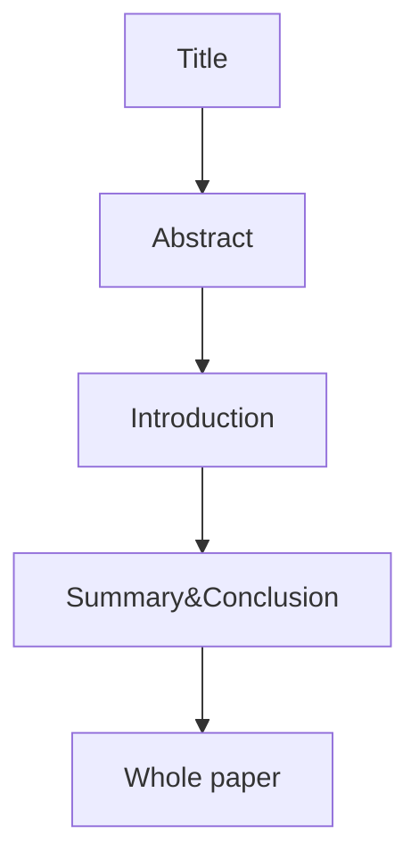

# How to Write a Successful Research Paper

---

**Emoji** that I get used to noting in this [course](https://www.udemy.com/share/101Xu63@LGMWmpmkCYPC47r2h7X-rnsBojPWw18n9aFe9YZ-wvtSbjjyqJmtGCPTt-M6-Jgg9g==/):

- :heavy_check_mark: represents the section (week X) is done (or finished) by myself. 
- :white_check_mark: represents this small part is done (or finished) by myself.
- :red_circle: represents the assignment that I  need to work out.
- :pencil2: represents the original answers that I've written.
- :pushpin:/:memo: represents some Notes I take from the course.
- :one:—:five: represents sequence or importance, both is ok.
- **(submitted)** represents I  SUBMIT the answers, and it's the final version I've revised in my relative limited time.

---

## Section 1: What You Need to Know About Writing Research Papers

### Introduction:white_check_mark:

### Two Elements of an Effective Research Compelling Without Overselling it

### Avoid Wasting Time: Two Strategies to Streamline Your Writing

## Section 2: How to  Conduct Your Literature Search

### 5. The Three Goals of the Introduction Section:white_check_mark:

:memo:To show readers why your research question is interesting and worth answering:

- **Importance:** It helps to solve a problem or advances our understanding
- **Novel:** it hasn't been done before
- **Timely:** it is the logical next step 

:memo:Essential parts；

- Importance: Why is your topic interesting?
- Literature review: What research has already been conducted? Are there conflicted or gaps?
- Research question: What is the qurestion?
- Outline of your paper: To answer the question, what needs to be done?

### 8.How to Quickly Scan Research Articles:white_check_mark:

:memo:To quickly scan it to decide whether use it or not: 

## Section 3: How to Create Your Introduction Section