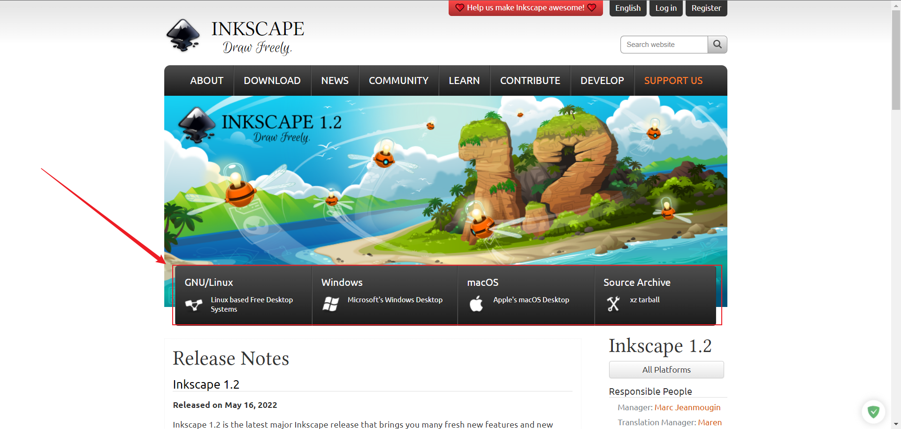

# Inkscape for Scientists and Engineers

## Introduction

***Inkscape*** is professional quality vector graphics software which runs on Linux, Mac OS X and Windows desktop computers.

## Installation

Click this official [download link](https://inkscape.org/) to have an installation on your own machine. 

## Usage

As we've already known that Inkscape is an open-source software, so there are  a lot of tutorials for both beginners and advanced designers. After finishing this course of Inkscape from Udemy, I've already handled the basic and some high-level skills of using Inkscape, here some other online material for the future improvement, and they're also for those who are totally new and want to learn how to use it properly.

- [Inkscape Beginners' Guide](https://inkscape-manuals.readthedocs.io/en/latest/index.html#)

In order to draw out the desired product as soon as possible, sometime I would choose to use some free or paid raw designing materials, here is a list that may usually use and could save a lot of rewheeling the tire time:

**Free** matrials

- [Freesvg](https://freesvg.org/)
- [Pixabay](https://pixabay.com/)
- [pngfind](https://www.pngfind.com/): included all materials are in .png format.
- [SVG REPO](https://www.svgrepo.com/): includes free svg and icons.
- [Unsplash](https://unsplash.com/): free high quality pictures.

Paid materials

- [Freepik](https://www.freepik.com/)
- [Icon8](https://icons8.com/)
- [Flaticon](https://www.flaticon.com/)
