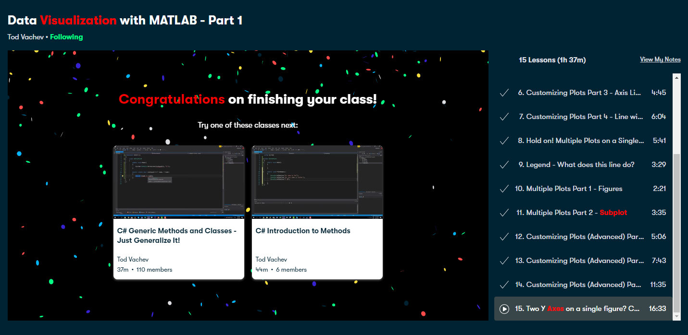
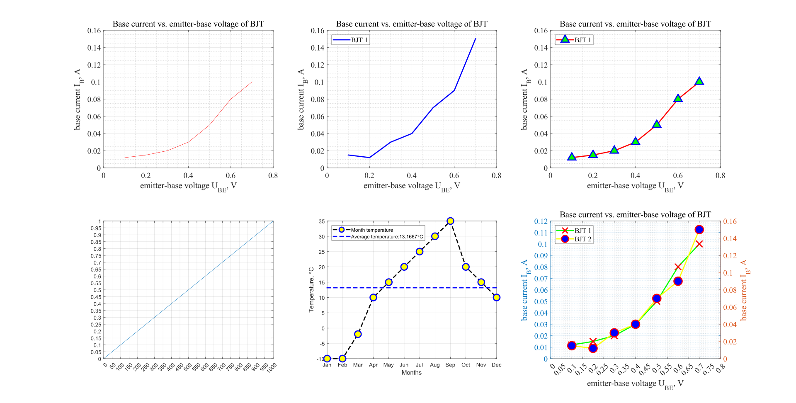

# Matlab Club

## Master MATLAB through Guided Problem Solving(Udemy)

​		In this file, I would mainly put some course notes of learning matlab software in this documents, some tips like self-learning through searching engine and other third party, there is another file that was created  to integrate them with the online learning sources, like some necessary and related materials, useful website etcs.

### Section 1: Course Introduction:white_check_mark:

Some introduction stuffs

### Section 2: Getting Started:white_check_mark:

#### 6.Create, edit, and open scripts

**Live Notes**:

1. To have a new script :`edit`
   - To run the whole specific script document, tap the file name in command window, then press `Enter` to evaluate or execute;
2. Layout: drag;
3. File name rule: just letters and numbers;
   1. To check the files within the current fold: `ls` / `what`, `ls` shows all files in the current fold, and `what`only shows Matlab format file ;
   2. Open file (script): `edit` + `file name`, then hit the `Tab`, it will open the object;
4. Calculation
   - Boolean: 1 / 0

#### 7.Write Comments in Lines and Blocks

Live Notes:

1. Comments

   - To make a comment, start with a single symbol `%`;

   - Multiple code line ends with `...`, after the `...`, it's all regarded as comments by Matlab.

   - To make multiple comments,:

     ```matlab
     %{
     
     Please comments in here.
     
     %}
     ```

   - `%%` makes a cell.

2. Shortcuts

   - `Ctrl`  + `R`: To make a comment; `ctrl` + `T`:  To make a uncomment. Hint: select multiple lines and use this shortcut to quickly make some comments.
   - To run the cell/section of the code (not the whole script)
     - *References:[1](https://ww2.mathworks.cn/help/matlab/matlab_prog/create-and-run-sections.html)*
   - `clear`、`close all`、`clc`: clear the previous  results

#### 8.Using MATLAB for a Personal Budget

**Live Notes:**

1. Use semicolon at end of each code line:`;` to omit the appearance of the caculated results ; 
2. Function
   -  parentheses:`()`
   - `disp()`: 
   - `num2str()`
     - In the function, when it comes to connect string and variable at the same time, using the square brackets`['this is a string' num2str(number)'this is another string']` within the `()` of function;
3. Give a meaningful and readable name to the Variable; 

### 9.Personalize MATLAB Colors

Live Notes:

1. 预设：
   - color；font; layout etcs;
   - User defined shortcut;

### 10.Start MATLAB with an Encouraging Note

Live Notes;

1. `edit startup` to create the startup script in the current fold.

### Section 3: Vectors and Variables

#### 11.Create Vectors and Matrices✔️

Live Notes:

1. Vectors: *row*(行) **X** *column*(列)
   - row:
     - vectRow = [ 1, 2, 3 ]; 1x3 (one by three);
   - column
     - vectColumn = [ 1; 2; 3 ]; 3x1 (three by one);
   - matrix
     - function - `ones (R,C)`: one (5) - 5x5; one (5,1) - 5x1;`randn (R,C)`
   - use `whos` to check the size of the vector type (like `1x9) means one buy nine, it's a row vector`;
   - the apostrophe (`` `) converts the row vector into column vector; **or** use the function `transpose(this is a row or ccolumn vector needing to be coverted into the vector of its opposite type)`

#### 12.Unsolved: Valid and invalid Matrices✔️

#### 13.Working with Text (Characters and Strings)✔️

------

**Assignment:** Parse text according to spaces and remove 4-letter words.

**Bonus:** Identify text patterns and replace with other patterns of different length.

**Skills:** regexp, cellfun, strfind, concatenate.

------

#### 14.HTML Table from MATLAB Code

**Assignment:** Generate a table of letters and numbers, and print them into an html table that can be read in a web browser.

**Skills:** char, randn, randi, disp, for, fprintf, num2str


#### 15.Round pi to N significant Digits✔️

#### 16.File/folder Information Using Structures✔️

Live Notes:

1. `cd`+`folder‘s name`: to find the object folder

### Section 4: Command Statements

#### 17.Create a Hilbert Matrix Using for-loops✔️

#### 18.Unsolved:Compare two while Loops✔️

#### 19. Create an Upper-Triangular Matrix✔️

#### 20.Random Count-Down Timer(Poisson like)

Live Notes:

1. Make sure the mouse sensor is inside Command window, then press `ctrl` + `Enter` to calculate the section.
2. Smart indent: select all the code lines, right click, choose the smart indent.

#### 21.Display the day of 1 January

### Section5

#### ...

#### 23.Import Formatted Text Data

#### 24.Import Excel-format Data

Live Notes:

1.Reference：`help` + `function name` or `doc` + `function name` (the latter could show more detail).

## Become a Good Matlab Programmer in 30 days(Udemy)

### Section 20：Advanced Plotting in Matlab

#### 105.What are subplots and Hold commands in Matlab?✔️

#### 106.Graph Properties in Matlab and how to customize them?

Live Notes:

1. hold on / hold off: make all figures show in one window

## Data Visualization With Matlab - Part 1(Skill Share)

Matlab 二维作图笔记：

```matlab
%% Skill Share:
% Topic: Basic Knowledge of Plotting

clc, clear, close all

%u = [0.1 0.2 0.3 0.4 0.5 0.6 0.7];                     %voltage
u = 0.1:0.1:0.7;                                       %voltage
i = [12e-3 15e-3 20e-3 30e-3 50e-3 80e-3 100e-3];      %current

%figure(1) ：用以区别图形不同的窗口和图形内容
subplot(2,3,1) %定义一个2x3网格，明确本图位置在1（从第二象限为数值1开始，顺时针方向数起，该初始位置标记为1）
figure(1)
plot(u, i, 'r')

xlabel('emitter-base voltage U_{BE}, V')
ylabel('base current I_B, A')

title('Base current vs. emitter-base voltage of BJT')

grid on
grid minor

set(gca,'FontName', 'Times New Roman', 'FontSize', 14) %gca-读取现在窗口中的图形内容

%xlim([0 0.8])
%ylim([0 110e-3]) 这两行等价于下面一行    
axis([0 0.8 0 160e-3])

i2 = [15e-3 12e-3 30e-3 40e-3 70e-3 90e-3 150e-3]; % current

hold on

%figure(2)
subplot(2,3,2)%定义一个2x3网格，明确本图位置在2（从第二象限为数值1开始，顺时针方向数起）
plot(u, i2, 'b', 'LineWidth', 2)

legend('BJT 1', 'BJT 2', 'Location', 'NorthWest') %放在plot后面，BJT 1 定义第一个图的的标签；legend位置配合东南西北四个方向；

xlabel('emitter-base voltage U_{BE}, V')
ylabel('base current I_B, A')

title('Base current vs. emitter-base voltage of BJT')

grid on
grid minor

set(gca,'FontName', 'Times New Roman', 'FontSize', 14)

xlim([0 0.8])
ylim([0 160e-3])

%hold off
%% Topic: Marker
%clc, clear, close all

u = 0.1:0.1:0.7;                                       %voltage
i1 = [12e-3 15e-3 20e-3 30e-3 50e-3 80e-3 100e-3];      %current


%plot(u, i1, 'o-r', 'LineWidth', 2)
%figure(2)
subplot(2,3,3)
myplot = plot(u, i1, 'o-r', 'LineWidth', 2); %对marker进行更多定义,将其值赋给一个变量；改变此处的线宽，实际影响图形中的线宽和markerface的宽度（圆圈变厚）


xlim([0 0.8])
ylim([0 160e-3])

grid on
grid minor

xlabel('emitter-base voltage U_{BE}, V')
ylabel('base current I_B, A')
title('Base current vs. emitter-base voltage of BJT')
set(gca,'FontName', 'Times New Roman', 'FontSize', 14)
legend('BJT 1', 'Location', 'NorthWest') 

set(myplot, 'Marker', '^', 'MarkerEdgeColor', 'blue', 'MarkerFaceColor', 'green','MarkerSize', 13)

%% Topic: Ticks
%clc, clear, close all


xvalues = 0:10:1000;
yvalues = 0:0.01:1;

%figure(3)
subplot(2,3,4)
plot(xvalues, yvalues)

%set(gca, 'xTick', [0 25 50 75 100]) %两者等价
%set(gca, 'xTick', 0:25:100)
%set(gca, 'xTick', min(xvalues):5:max(xvalues))

XTickSteps = 50;
YTickSteps = 0.05;

set(gca, 'xTick', min(xvalues):XTickSteps:max(xvalues))
set(gca, 'YTick', min(xvalues):YTickSteps:max(xvalues))

grid on

%% Topic: Line
%clc, clear, close all

temp = [-10 -10 -2 10 15 20 25 30 35 20 15 10];
month = 1:12;

%figure(4)
subplot(2,3,5)
h = plot(month, temp, 'o--k', 'LineWidth', 2);
grid on

xlim([1 12]) %注意坐标轴上下限这里是空格
ylim([min(temp) max(temp)])

set(gca, 'XTick', 1:1:12)
%set(gca, 'XTickLabel', 'Month') %X轴label全为 Month
%set(gca, 'XTickLabel', ['Month 1'; 'Month 2']) %X轴label全为 Month 1 Month 2 交替
set(gca, 'XTickLabel', ['Jan'; 'Feb'; 'Mar'; 'Apr'; 'May'; 'Jun'; 'Jul'; 'Aug'; 'Sep'; 'Oct'; 'Nov'; 'Dec'])

set(h, 'MarkerEdgeColor', 'blue', 'MarkerFaceColor', 'yellow', 'MarkerSize', 12) %第一个值用于选择目标图像

xlabel('Months')
ylabel('Temperature, \circC')

temp_average = mean(temp);


line([min(month) max(month)], [temp_average temp_average], 'LineStyle', '--', 'LineWidth', 2, 'Color', 'blue')
legend('Month temperature', ['Average temperature:', num2str(temp_average), '\circC'], 'Location', 'NorthWest')  %Legend位置用Location,后接东南西北

%% Topic: Two y axis

%clc, clear, close all


u = 0.1:0.1:0.7;                                       %voltage
i1 = [12e-3 15e-3 20e-3 30e-3 50e-3 80e-3 100e-3];      %current
i2 = [15e-3 12e-3 30e-3 40e-3 70e-3 90e-3 150e-3];      %current

%myplot = plot(u, i1, 'r', 'LineWidth', 2);

%xlim([0 0.8])  %小结：在考虑代码位置时，记住从从总体到局部的理念，先粗略勾画设置，后面的代码应该是在此基础上越来越详细，如果违背了这一理念，那么顺序就可能是不合适或错误的
%ylim([0 160e-3]) %↓↓↓

%figure(5)
subplot(2,3,6)
[ax, y1, y2] = plotyy(u, i1, u, i2)      %再放在这里运行;运行此行前的代码（原始图像）

% Limits values
xstartlim = 0;
xendlim = 0.8;
y1startlim = 0;
y1endlim = 120e-3;
y2startlim = 0;
y2endlim = 160e-3;

% Plots limits
xlim(ax(1), [xstartlim xendlim]) %对两个x轴坐标都要进行范围限定
xlim(ax(2), [xstartlim xendlim])
ylim(ax(1), [y1startlim y1endlim])
ylim(ax(2), [y2startlim y2endlim])

% Grid settings
grid on
grid minor

% Plot annotations
xlabel('emitter-base voltage U_{BE}, V')
ylabel('base current I_B, A') %↓↓↓
ylabel(ax(1), 'base current I_B, A')
ylabel(ax(2), 'base current I_B, A')
%set(gca,'FontName', 'Times New Roman', 'FontSize', 14) %↓↓↓
set(ax(1), 'FontName', 'Times New Roman', 'FontSize', 14)  %设置两个x轴的参数
set(ax(2), 'FontName', 'Times New Roman', 'FontSize', 14)
legend('BJT 1', 'BJT 2', 'Location', 'NorthWest') 
title('Base current vs. emitter-base voltage of BJT')
%plotyy(u, i1, u, i2) %建议使用 yyaxis left/right；先放在这里运行

% Markers and Colors
set(y1, 'Color', 'green', 'LineWidth', 2)
set(y2, 'Color', 'yellow', 'LineWidth', 2)
set(y1, 'Marker', 'x', 'MarkerEdgeColor', 'red', 'MarkerSize', 15)
set(y2, 'Marker', 'o', 'MarkerEdgeColor', 'red', 'MarkerFaceColor', 'blue', 'MarkerSize', 15)

% X and Y Ticks
set(ax,'XTick', xstartlim:0.05:xendlim) %不再是gca，而用ax
set(ax(1), 'YTick', y1startlim:0.01:y1endlim) %改变Y1的Ticks，首先是选择对应的x轴，再对YTick进行操作；此时这里的YTick范围主要参考前面的y的范围，比其上下限略大即可。
set(ax(2), 'YTick', y2startlim:0.02:y2endlim)


% 完成时间：2022.08.29下午
```

Screenshot:



All plots are put into practice:




