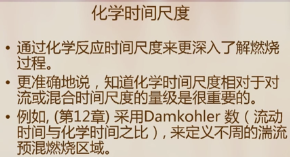
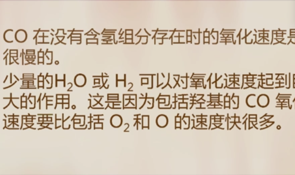

# 燃烧理论

## Chapter 1 导论

## Chapter 2 燃烧与热化学

氮氧化物-吸热反应

### 2.4 反应物和生成物的混合物

#### 反应物和生成物的组成

- 化学当量的空燃比：每1kg燃料完成燃烧所需空气量；
- 当量比<1, 贫燃；
- 过量空气比

- 空气过量系数：实际空气量与理论空气量之比。（以体积作为单位，即每1kg燃料燃烧所对应的空气体积）

- 空燃比

#### 绝对（或标准）焓和生成焓值

标准状态: 常温常压。

#### 燃烧焓与热值

... ...

## Chapter 4 化学动力学

### 4.1 概述

#### 概述

水的存在催化CO与氧气发生反应。

概述：

将在第五章主讲5个燃烧化学机理。

### 4.2 总包反应与基元反应

KG-总包反应系数（global rate coefficient）为温度的函数。

与氧化剂碰撞出中间产物：自由基或活化分子，具有不成对的电子。

### 4.3 基元反应速率

#### ①双分子反应和碰撞理论

- 空间（形状）因子

#### ②其他基元反应

- 范特霍夫关系式
- 阿伦尼乌斯（Arrenius）

- 其他
  - 单分子反应
  - 双分子反应
  - 三分子反应

### 4.4 多步反应机理的反应速率

#### ①净生成率

所有的正反应与副反应之差。

#### ②反应速率常数与平衡常数关系

燃烧学者: Hanson (Stanford)和 Salimian 

热力型NO机理/Zeldovich

#### ③稳态近似

很针对某一组分，假设其浓度很快保持不变。

#### ④单分子反应机理

高压为一阶，低压为二阶。

#### ⑤链式反应和链式分支反应（一）

**链式反应**：

链的传递反应：

- 链的激发反应
- 链的传播反应
- 链的终止/中断反应：最终形成稳定产物。

**链式分支反应**：

#### ⑥链式反应和链式分支反应（二）

热力型氮氧化物需要考虑逆反应，否则浓度水平容易被高估；

#### ⑦化学时间尺度（一）

概念：化学反应完成所需的时间

比较Damkohler数与1的大小，来判断流动与化学的影响权重。

#### ⑦化学时间尺度（二）

#### ⑧部分平衡

### 4.5 简化机理

### 4.6 催化和非均相反应

## Chapter 5 一些重要的化学机理

### 5.1 概述

### 5.2 H2-O2系统

#### ①H2-O2系统

#### ②H2-O2系统爆炸特性

### 5.3 一氧化碳的氧化

21%纯氧+79%的氮气，与一氧化碳反应，不能燃烧。原因是缺水（没有含氢组分（羟基）的存在，其反应速率将会非常缓慢）。

